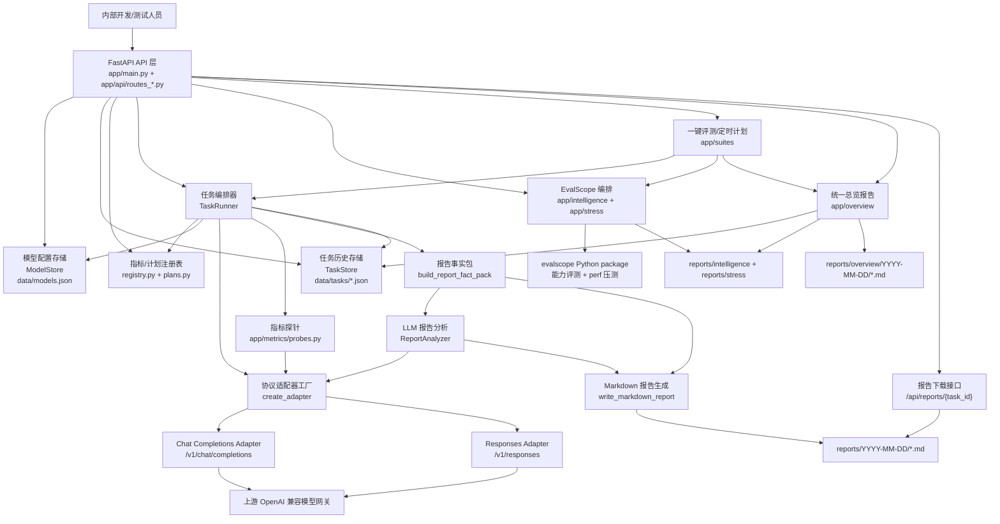
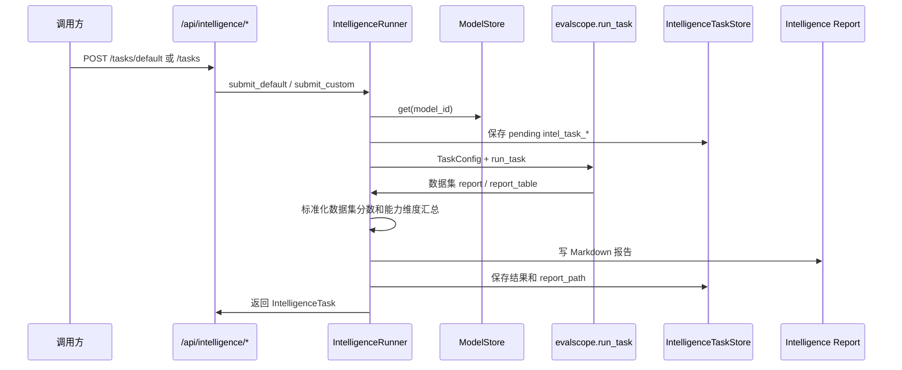
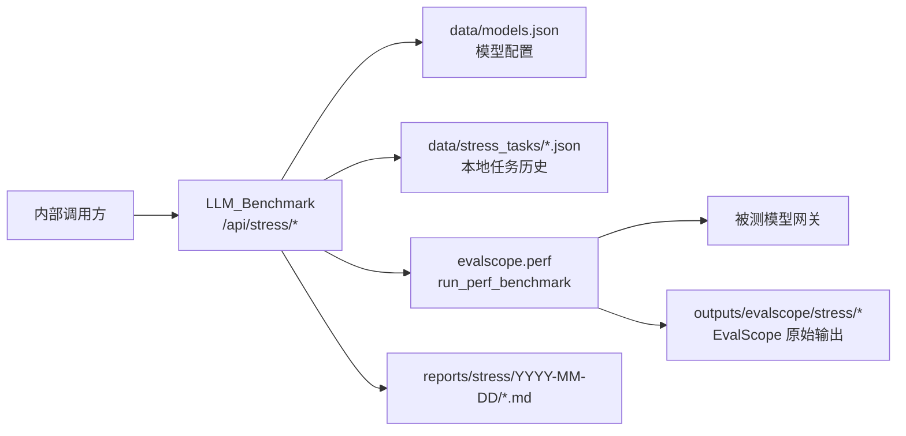
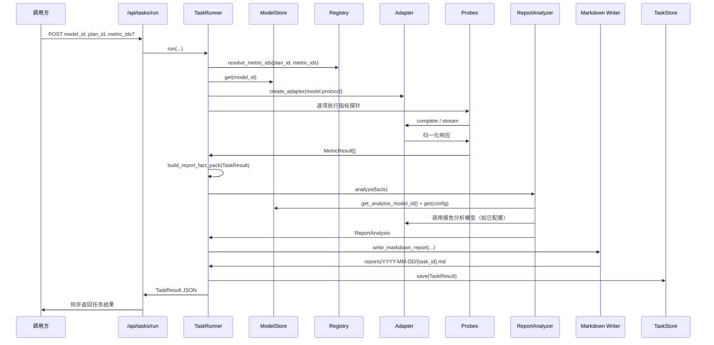
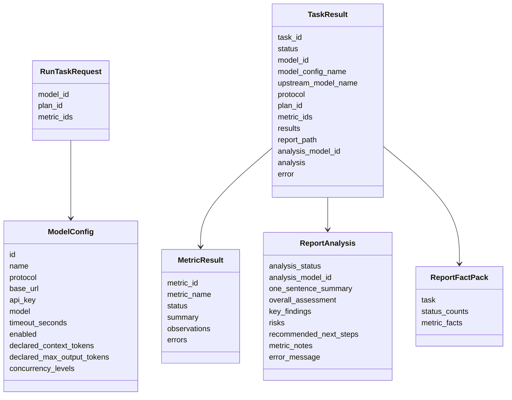

# 系统架构说明

> 本文档面向后续接手项目的 Codex / 开发人员，用于快速理解当前系统结构。后续如果接口、评测计划、指标执行链路、存储结构或报告生成流程发生变化，必须同步更新本文档。

## 1. 项目定位

本项目是一个**内网使用的大模型 API 基础工程评测服务**，用于模型接入模型网关前采集上线前验证数据。

当前边界：

- 面向内部开发/测试人员，不做公开 SaaS。
- 不做平台鉴权；上游模型 API Key 保存在本地运行目录。
- 不使用 SQL；模型配置、任务历史和报告均落本地文件。
- 评测任务当前为同步执行：接口调用会等待指标执行、报告分析、报告写入完成后再返回。
- 服务只输出结构化观测数据和 Markdown 报告，不自动给出“上线通过 / 失败”的结论。
- 支持 OpenAI 兼容的 `chat_completions` 与 `responses` 两类协议。
- 通过主服务进程内直接调用 EvalScope Python package 接入能力评测和 EvalScope `perf` 压测；本系统负责统一编排、脱敏、落库和摘要导航。`/api/tasks/run` 只保留网关接入验收 smoke，不再承担正式能力评测或压测。`/api/suites/*` 提供一键评测和定时低峰触发。

## 2. 技术栈与入口

| 类型 | 当前选择 | 关键位置 |
|---|---|---|
| Python 环境/依赖 | `uv` | `pyproject.toml`、`uv.lock` |
| Web 框架 | FastAPI | `app/main.py` |
| HTTP 客户端 | httpx async client | `app/adapters/*.py` |
| 数据校验/模型 | Pydantic | `app/core/models.py`、`app/reports/schemas.py` |
| 本地存储 | JSON 文件 | `app/storage/*.py`、`data/` |
| EvalScope 执行 | 主服务内 in-process 调用 | `app/intelligence/evalscope_direct.py`、`app/stress/evalscope_direct.py`、`outputs/evalscope/` |
| 报告输出 | Markdown | `app/reports/markdown.py`、`app/intelligence/report.py`、`app/stress/report.py`、`app/overview/report.py`、`reports/` |
| 一键编排/定时 | 本地 suite + 轻量轮询器 | `app/suites/*`、`app/api/routes_suites.py`、`data/suite_runs/`、`data/suite_schedules/` |
| 测试框架 | pytest | `tests/` |
| 本地假上游 | FastAPI 示例服务 | `examples/fake_openai_server.py` |

启动命令：

```powershell
uv sync
uv run uvicorn app.main:app --host 0.0.0.0 --port 8000
```

健康检查：

```http
GET /health
```

## 3. 总体架构图



## 4. 代码分层

### 4.1 API 层：`app/main.py`、`app/api/`

职责：

- 创建 FastAPI 应用。
- 注册业务路由。
- 统一转换 HTTPException 为标准错误结构。
- 暴露模型配置、指标计划、任务执行、任务查询、报告下载接口，以及独立的 EvalScope 智力评测和压测接口。

关键文件：

| 文件 | 职责 |
|---|---|
| `app/main.py` | FastAPI 应用入口，注册 `/health` 与 `/api/*` 路由。 |
| `app/api/errors.py` | 统一错误格式：`{"error": {"code", "message", "details"}}`。 |
| `app/api/routes_models.py` | 模型配置 CRUD；响应会脱敏 `api_key`。 |
| `app/api/routes_metrics.py` | 查询指标元数据与评测计划。 |
| `app/api/routes_tasks.py` | 同步执行评测任务、查询任务历史。 |
| `app/api/routes_reports.py` | 根据 `task_id` 下载 Markdown 报告。 |
| `app/api/routes_intelligence.py` | 暴露 `/api/intelligence/*` 智力评测接口，执行本地 EvalScope 健康/数据集查询、提交评测、读取结果和下载报告。 |
| `app/api/routes_stress.py` | 暴露 `/api/stress/*` 压测接口，提交主服务内 EvalScope perf 任务、读取结果和下载本地报告。 |
| `app/api/routes_overview.py` | 暴露 `/api/overview/reports*` 统一总览接口，引用已有三类任务生成中文摘要和详情导航。 |
| `app/api/routes_suites.py` | 暴露 `/api/suites/*` 一键评测与定时计划接口，串联网关验收、能力评测、压测和 overview。 |

### 4.2 核心领域层：`app/core/`

职责：定义系统的数据模型、协议枚举、指标计划注册和任务编排。

| 文件 | 职责 |
|---|---|
| `app/core/models.py` | Pydantic 数据模型：模型配置、任务请求、适配器请求/响应、指标结果、任务结果。 |
| `app/core/statuses.py` | 状态和协议类型，目前协议为 `chat_completions`、`responses`。 |
| `app/core/plans.py` | 默认接入验收计划 `gateway_acceptance_v1`、兼容旧名 `gateway_baseline_v1`，以及指标中文名称/说明。 |
| `app/core/registry.py` | 指标/计划查询与 `metric_ids` 解析校验。 |
| `app/core/runner.py` | `TaskRunner`，串联模型加载、协议适配、指标执行、报告分析、报告写入和任务落库。 |

### 4.3 协议适配层：`app/adapters/`

职责：将内部统一的 `AdapterRequest` 转换成不同 OpenAI 兼容协议的 HTTP 请求，并将响应归一化为 `AdapterResponse` / `StreamAdapterResponse`。

| 文件 | 职责 |
|---|---|
| `app/adapters/base.py` | `BaseAdapter` 抽象类与 `create_adapter(config)` 工厂。 |
| `app/adapters/chat_completions.py` | 调用 `{base_url}/chat/completions`，使用 `messages`、`max_tokens`、SSE `data:` 流。 |
| `app/adapters/responses.py` | 调用 `{base_url}/responses`，使用 `input`、`instructions`、`max_output_tokens`、Responses 风格 SSE。 |

适配层当前只依赖 `ModelConfig.protocol` 显式选择协议，不自动猜测协议。

### 4.4 指标层：`app/metrics/`

职责：实现默认评测计划中的基础工程指标。所有探针通过统一适配器访问上游，不直接关心具体协议。

| 文件 | 职责 |
|---|---|
| `app/metrics/base.py` | 生成 `completed` / `error` / `skipped` 三类 `MetricResult`。 |
| `app/metrics/probes.py` | 各指标探针实现。 |

当前默认计划 `gateway_acceptance_v1` 定位为“模型网关接入验收 / 协议 smoke”，包含：

| 顺序 | 指标 ID | 中文名 | 说明 |
|---:|---|---|---|
| 1 | `connectivity` | 连通性 | 检查基础调用、JSON、内容、`finish_reason`、`usage`。 |
| 2 | `latency_breakdown` | 延迟拆解 | 单次流式 smoke，采集 TTFT、端到端耗时、估算 TPS；正式延迟/吞吐以 EvalScope 压测为准。 |
| 3 | `context_length` | 上下文长度 | 分档构造长上下文 needle-in-haystack 请求，观察 API 接收与 marker 找回。 |
| 4 | `output_length` | 输出长度 | 按声明最大输出发起长输出请求，记录实际输出长度与结束原因。 |
| 5 | `error_handling` | 错误处理 | 构造无效 key、无效模型、空输入、非法参数、上下文超限等场景。 |
| 6 | `token_usage_accuracy` | Token 用量观测（Usage） | 观察 usage 字段，并与本地启发式估算辅助对比。 |
| 7 | `cache_behavior` | 缓存能力（Prompt Cache） | 通过长稳定前缀冷/热请求观察缓存字段、cached tokens、命中轮次和延迟变化。 |
| 8 | `stream_spec` | 流式规范性 | 检查 SSE 是否可解析、是否有 `[DONE]`、`finish_reason`、流式 usage。 |

`gateway_baseline_v1` 保留为兼容旧调用方的计划名，指标集合与 `gateway_acceptance_v1` 相同。`concurrency` 与 `rate_limit` 仍作为历史兼容的轻量性能 smoke 指标保留，可通过 `metric_ids` 显式运行，但不再进入默认接入验收计划；正式并发、吞吐、延迟分布和限流/容量边界以 EvalScope 压测为准。

详细测试方法见 `docs/metric-test-methods.md`。

### 4.5 智力评测层：`app/intelligence/`

职责：在主服务进程内直接调用 EvalScope Python package，提供独立于基础工程指标的“智力评测”能力。它不写入 `gateway_acceptance_v1`，也不影响 `/api/tasks/run` 的同步接入验收链路。

| 文件 | 职责 |
|---|---|
| `app/intelligence/schemas.py` | EvalScope 本地配置、智力评测请求、任务、标准化结果数据结构。 |
| `app/intelligence/config_store.py` | 读取可选 `data/evalscope.json`，只覆盖数据集目录、输出目录和 Judge；旧字段会被忽略。 |
| `app/intelligence/evalscope_direct.py` | 本地 import EvalScope，提供健康检查、数据集元数据、Judge 状态和 `run_task(TaskConfig)` 执行器。 |
| `app/intelligence/runner.py` | 读取本系统模型配置，提交 in-process EvalScope 评测，终态后标准化结果并生成报告。 |
| `app/intelligence/report.py` | 生成 `reports/intelligence/YYYY-MM-DD/*.md` 智力评测报告。 |
| `app/storage/intelligence_task_store.py` | 读写 `data/intelligence_tasks/intel_task_*.json`。 |

智力评测状态流：



安全边界：第一版只读取本地 EvalScope Judge 配置，不代理写 Judge；`api_key` 仅运行时传给 EvalScope，所有错误、报告、JSON 附录写入前都需要脱敏。
### 4.6 报告层：`app/reports/`

职责：把任务结果转换为面向人阅读的 Markdown 报告，并可选调用一个报告分析模型生成中文摘要。

| 文件 | 职责 |
|---|---|
| `app/reports/schemas.py` | 报告事实包和 LLM 分析结果的数据结构。 |
| `app/reports/facts.py` | 从 `TaskResult` 提取“报告事实包”，聚合状态计数、核心观测和建议关注点。 |
| `app/reports/analyzer.py` | 根据 `data/models.json` 顶层 `analysis_model_id` 选择分析模型，调用适配器生成分析 JSON。已处理 `<think>...</think>` 块干扰。 |
| `app/reports/markdown.py` | 生成网关接入验收 Markdown 报告，包含 LLM 分析、任务概览、指标仪表盘、指标总表、明细和附录。 |

报告分析设计要点：

- 分析失败不影响基础评测任务完成。
- 分析模型也使用普通 `ModelConfig`，因此同样支持 `chat_completions` / `responses`。
- 分析输出必须是结构化 JSON，字段包括一句话总结、总体分析、关键发现、风险、建议下一步和分指标备注。
- 写入报告前会调用脱敏逻辑，避免 API Key 等敏感内容进入报告。

### 4.7 存储层：`app/storage/`

职责：用本地 JSON 文件保存模型配置和任务结果。

| 文件 | 职责 |
|---|---|
| `app/storage/file_utils.py` | JSON 读写与原子写入。 |
| `app/storage/model_store.py` | 读写 `data/models.json`，包含模型列表和顶层 `analysis_model_id`。 |
| `app/storage/task_store.py` | 读写 `data/tasks/task_*.json`。 |
| `app/storage/intelligence_task_store.py` | 读写能力评测任务 `data/intelligence_tasks/intel_task_*.json`。 |
| `app/storage/stress_task_store.py` | 读写压测任务 `data/stress_tasks/stress_task_*.json`。 |
| `app/storage/overview_report_store.py` | 读写统一总览报告元数据 `data/overview_reports/overview_report_*.json`。 |
| `app/suites/store.py` | 读写一键评测 suite 和定时计划：`data/suite_runs/*.json`、`data/suite_schedules/*.json`。 |

存储路径：

| 内容 | 默认路径 | 可配置环境变量 | 是否应提交 |
|---|---|---|---|
| 模型配置 | `data/models.json` | `LLM_BENCHMARK_DATA_DIR` | 否，可能包含 API Key |
| 任务历史 | `data/tasks/*.json` | `LLM_BENCHMARK_DATA_DIR` | 否，运行产物 |
| Markdown 报告 | `reports/YYYY-MM-DD/*.md` | `LLM_BENCHMARK_REPORTS_DIR` | 否，运行产物 |
| EvalScope 可选覆盖配置 | `data/evalscope.json` | `LLM_BENCHMARK_DATA_DIR` | 否，仅覆盖本地目录或 Judge |
| 能力评测任务 | `data/intelligence_tasks/*.json` | `LLM_BENCHMARK_DATA_DIR` | 否，运行产物 |
| 能力评测报告 | `reports/intelligence/YYYY-MM-DD/*.md` | `LLM_BENCHMARK_REPORTS_DIR` | 否，运行产物 |
| 压测任务 | `data/stress_tasks/*.json` | `LLM_BENCHMARK_DATA_DIR` | 否，运行产物 |
| 压测报告 | `reports/stress/YYYY-MM-DD/*.md` | `LLM_BENCHMARK_REPORTS_DIR` | 否，运行产物 |
| 统一总览报告元数据 | `data/overview_reports/*.json` | `LLM_BENCHMARK_DATA_DIR` | 否，运行产物 |
| 统一总览 Markdown | `reports/overview/YYYY-MM-DD/*.md` | `LLM_BENCHMARK_REPORTS_DIR` | 否，运行产物 |
| 一键评测 suite | `data/suite_runs/*.json` | `LLM_BENCHMARK_DATA_DIR` | 否，运行产物 |
| 定时评测计划 | `data/suite_schedules/*.json` | `LLM_BENCHMARK_DATA_DIR` | 否，本地运行配置/状态 |

### 4.8 工具层：`app/utils/`

| 文件 | 职责 |
|---|---|
| `app/utils/ids.py` | 生成 `task_YYYYMMDDHHMMSS_xxxxxxxx` 格式任务 ID。 |
| `app/utils/masking.py` | 脱敏 API Key。 |
| `app/utils/sse.py` | SSE 相关工具。 |
| `app/utils/timing.py` | 单调时钟计时工具。 |
| `app/utils/token_estimator.py` | 简单中英文混合 token 估算，仅用于辅助观察。 |


### 4.9 EvalScope 压测层：`app/stress/`

压测执行已收缩为主服务内直接调用 EvalScope perf，不再维护额外 HTTP 包装服务：



本系统职责：

- 根据 `ModelConfig.protocol` 自动把模型配置映射为 EvalScope `api=openai` 或 `api=openai_responses`。
- 只在运行时把 `api_key` 传给 EvalScope，本地 `request_config`、报告和 API 响应不保存明文密钥。
- 构造 `evalscope.perf.arguments.Arguments` 并调用 `evalscope.perf.main.run_perf_benchmark`。
- 将 EvalScope perf 结果标准化为并发档位、吞吐、成功率、延迟、TTFT、TPOT 和异常摘要。
- 写入 `data/stress_tasks/`、`outputs/evalscope/stress/` 和 `reports/stress/YYYY-MM-DD/`。

压测能力目前作为正式性能/负载来源，覆盖并发承载、限流/容量边界以及延迟/吞吐分布。基础 `/api/tasks/run` 中的 `latency_breakdown` 只保留单次流式 smoke；`concurrency`、`rate_limit` 可显式运行作为历史兼容 smoke，但不替代正式压测报告。

### 4.10 统一总览报告层：`app/overview/`

统一总览报告层是本次收缩后的最终展示入口，负责把已有网关接入验收任务、EvalScope 能力评测任务和 EvalScope 压测任务合并为一份中文 Markdown 摘要。

它的边界很窄：

- 不触发新的评测或压测任务。
- 不重新计算 EvalScope 原始指标，不替代 EvalScope 自带表格、日志和可视化。
- 只读取 `TaskStore`、`IntelligenceTaskStore`、`StressTaskStore` 中已经归档的结果。
- 只生成“一眼看懂”的状态摘要、关键观测、关注点和三类详情入口。
- 所有写入 Markdown 的文本仍走脱敏处理。

关键文件：

| 文件 | 职责 |
|---|---|
| `app/overview/schemas.py` | `OverviewReportRequest`、`OverviewComponent`、`OverviewReport` 数据结构。 |
| `app/overview/report.py` | 汇总三类任务，生成 overview 元数据和 `reports/overview/YYYY-MM-DD/*.md`。 |
| `app/storage/overview_report_store.py` | 保存/读取/列出 `data/overview_reports/*.json`。 |
| `app/api/routes_overview.py` | 暴露创建、列表、详情和 Markdown 下载接口。 |

最终展示形态：一份中文总览 + 三类详情入口。网关接入验收看本系统 smoke 指标；能力评测和压测看 EvalScope；本系统只做内部模型网关场景下的编排、脱敏、归档和摘要导航。

### 4.11 一键评测与定时层：`app/suites/`

Suite 层解决“一个模型 ID 自动完成整套评测并出最终总览报告”的问题，同时支持在半夜等低峰期定时触发。

职责边界：

- 复用现有 `TaskRunner`、`IntelligenceRunner`、`StressRunner` 和 overview 生成器，不新增指标。
- `POST /api/suites/default` 创建 suite；后台模式立即返回 `suite_id`，同步模式等待完成后返回。
- suite 顺序执行：网关接入验收 -> EvalScope 能力评测 -> EvalScope 压测 -> overview 总览报告。
- 子任务失败时尽量继续生成 overview；suite 可能进入 `partial`，便于报告中展示缺失模块和错误。
- `POST /api/suites/schedules` 保存本地定时计划，主服务启动后轻量轮询器按 `next_run_at` 自动触发。
- 定时计划只保存在本机 JSON，不依赖外部任务队列；如果未来要多实例部署，需要引入分布式锁或外部调度器。

关键文件：

| 文件 | 职责 |
|---|---|
| `app/suites/schemas.py` | `SuiteDefaultRunRequest`、`SuiteRun`、`SuiteSchedule` 等数据结构。 |
| `app/suites/runner.py` | 串联三类 runner，等待 EvalScope 终态，生成 overview。 |
| `app/suites/store.py` | 本地 JSON 存储 suite 和 schedule。 |
| `app/suites/scheduler.py` | 服务内轻量定时轮询器，支持 `LLM_BENCHMARK_SCHEDULER_DISABLED` 关闭。 |
| `app/api/routes_suites.py` | suite 启动、查询、报告下载、定时计划 CRUD 和手动触发接口。 |
## 4.12 单服务部署层：`scripts/`

推荐部署方式：一个仓库、一台服务器、一个 FastAPI 主服务进程。主服务监听 `8000`，能力评测和压测在进程内直接调用 EvalScope Python package。

| 文件 | 用途 |
|---|---|
| `scripts/start_main.ps1` / `scripts/start_main.sh` | 启动 `LLM_Benchmark` 主服务。 |
| `scripts/start_all.ps1` / `scripts/start_all.sh` | 单服务启动入口；当前等价于启动主服务并提示 in-process EvalScope 模式。 |
| `scripts/test_deployment.py` | 检查主服务健康检查，以及主服务内 EvalScope intelligence/stress 健康入口。 |
| `scripts/smoke_deploy.py` | 使用临时 `data/`、`reports/`、`outputs/` 目录拉起测试端口并自动执行部署健康检查。 |

可选目录覆盖示例见 `data/evalscope.json.example`，详细部署步骤见 `docs/deployment.md`。

## 5. 同步评测执行流程



重要行为：

1. `TaskRunner` 首先解析计划和指标；非法计划/指标会在 API 层转换为 400。
2. 如果模型不存在、禁用或协议不支持，任务状态为 `error`，并写入任务历史。
3. 单个指标出现 `error` 不会中断整个任务；后续指标仍会继续执行。
4. `latency_breakdown` 与 `stream_spec` 共享一次流式请求结果。
5. `cache_behavior` 会顺序发起三轮非流式长前缀请求；它只输出观测结果，不做自动阈值判定。
6. `concurrency` 与 `rate_limit` 共享一组并发请求结果。
7. 报告分析模型未配置或失败时，基础任务仍完成，报告中记录跳过/失败原因。
8. 最终 API 返回 `TaskResult` JSON，同时落库任务 JSON 并生成 Markdown 报告。

## 6. 数据结构主线



## 7. API 与文档关系

接口清单与请求/响应细节维护在 `docs/api.md`。

当前公开接口：

```http
GET    /health

POST   /api/models
GET    /api/models
GET    /api/models/{model_id}
PUT    /api/models/{model_id}
DELETE /api/models/{model_id}

GET    /api/metrics
GET    /api/plans
GET    /api/plans/{plan_id}

POST   /api/tasks/run
GET    /api/tasks
GET    /api/tasks/{task_id}

GET    /api/reports/{task_id}

GET    /api/intelligence/evalscope/health
GET    /api/intelligence/evalscope/judge-config
GET    /api/intelligence/evalscope/tasks
GET    /api/intelligence/datasets
GET    /api/intelligence/datasets/local
POST   /api/intelligence/tasks/default
POST   /api/intelligence/tasks
GET    /api/intelligence/tasks
GET    /api/intelligence/tasks/{task_id}
GET    /api/intelligence/tasks/{task_id}/result
GET    /api/intelligence/reports/{task_id}

GET    /api/stress/evalscope/health
POST   /api/stress/tasks/default
POST   /api/stress/tasks
GET    /api/stress/tasks
GET    /api/stress/tasks/{task_id}
GET    /api/stress/tasks/{task_id}/result
GET    /api/stress/reports/{task_id}

POST   /api/overview/reports
GET    /api/overview/reports
GET    /api/overview/reports/{overview_id}
GET    /api/overview/reports/{overview_id}/markdown

POST   /api/suites/default
GET    /api/suites
POST   /api/suites/schedules
GET    /api/suites/schedules
GET    /api/suites/schedules/{schedule_id}
DELETE /api/suites/schedules/{schedule_id}
POST   /api/suites/schedules/{schedule_id}/trigger
GET    /api/suites/{suite_id}
GET    /api/suites/{suite_id}/report
```

## 8. 开发扩展指南

### 8.1 新增指标

1. 在 `app/metrics/probes.py` 中新增探针函数，返回 `MetricResult`。
2. 在 `app/core/plans.py` 中增加指标 ID、中文名、说明，并加入对应计划。
3. 在 `app/core/runner.py` 中编排该指标的执行顺序；能复用请求时尽量复用。
4. 更新 `docs/metric-test-methods.md`。
5. 如报告核心观测需要更友好展示，更新 `app/reports/facts.py`。
6. 补充或更新测试。

### 8.2 新增协议

1. 在 `app/core/statuses.py` 中扩展 `Protocol` 与 `SUPPORTED_PROTOCOLS`。
2. 在 `app/adapters/` 新增适配器，实现 `complete()` 和 `stream()`。
3. 在 `app/adapters/base.py` 的 `create_adapter()` 中注册协议。
4. 更新 `docs/api.md`、`docs/metric-test-methods.md` 和本文档。
5. 增加适配器单元测试与假上游测试。

### 8.3 调整报告结构

1. 修改 `app/reports/schemas.py` 中的报告结构。
2. 修改 `app/reports/facts.py` 的事实包提取逻辑。
3. 修改 `app/reports/analyzer.py` 的系统提示词和 JSON 校验。
4. 修改 `app/reports/markdown.py` 的排版。
5. 更新相关测试和本文档。

### 8.4 扩展智力评测

1. EvalScope Python package 接口变化时，先用本地安装包或官方文档确认签名，再更新 `app/intelligence/evalscope_direct.py`。
2. 如果新增本系统智力评测接口，必须同步更新 `docs/api.md`、本文档和 API 覆盖测试。
3. 如果报告字段变化，更新 `app/intelligence/report.py` 和 `tests/test_intelligence_report.py`。
4. 不要把 EvalScope Judge 写配置能力默认开放；如确需开放，应先补安全设计。
5. 不要把智力评测强行加入基础工程指标，除非明确调整产品边界和报告结构。

### 8.5 扩展压测能力

1. EvalScope perf 参数变化时，先更新 `app/stress/schemas.py` 和 `app/stress/evalscope_direct.py`。
2. EvalScope perf 结果字段变化时，更新 `app/stress/runner.py` 的标准化逻辑。
3. 新增压测报告字段时，更新 `app/stress/report.py`、`docs/api.md`、`docs/metric-test-methods.md` 和测试。
4. 不要在任务 JSON、报告或日志中保存明文 `api_key`。

### 8.6 调整统一总览报告

1. 总览报告只引用已有任务；如要改成自动触发任务，需要先更新 API 语义、状态机和安全边界。
2. 新增或删除总览字段时，更新 `app/overview/schemas.py`、`app/overview/report.py`、`docs/api.md`、`README.md` 和测试。
3. 如果三类详情入口变化，必须同步更新总览 Markdown、API 文档和 API 覆盖测试。
4. 不要把 EvalScope 的完整可视化或原始大表复制进 overview；overview 只保留摘要和导航。

### 8.7 扩展一键评测和定时计划

1. Suite 层只做编排；新增正式评测能力时应优先接入 EvalScope 或已有 runner，再由 suite 引用。
2. 修改 suite 状态或步骤字段时，更新 `app/suites/schemas.py`、`docs/api.md`、README、架构文档和测试。
3. 定时计划当前是单机轻量轮询；多实例部署前必须增加锁，避免同一计划被重复触发。
4. 定时压测建议配置较小默认档位，避免半夜任务无限排队或打满共享网关。

### 8.8 增加异步任务队列（未来方向）

当前是同步任务。若未来引入异步队列，需要重点调整：

- `POST /api/tasks/run` 的响应语义：可能从同步返回完整结果变成返回任务 ID。
- `TaskResult.status` 状态机：需要增加 queued/running 等状态。
- `TaskStore` 写入时机：需要支持运行中增量保存。
- 报告生成时机：任务完成后异步生成或单独触发。
- API 文档、架构文档和测试都需要同步更新。

## 9. Codex 快速排查入口

常用命令：

```powershell
# 运行测试
uv run pytest -q

# 启动服务
uv run uvicorn app.main:app --host 0.0.0.0 --port 8000

# 启动假上游服务
uv run uvicorn examples.fake_openai_server:app --host 127.0.0.1 --port 9001

# 查看 Git 状态
git status --short
```

快速定位：

| 想查什么 | 优先看哪里 |
|---|---|
| 接口定义 | `app/api/routes_*.py`、`docs/api.md` |
| 模型配置字段 | `app/core/models.py`、`docs/api.md` |
| 默认指标有哪些 | `app/core/plans.py`、`docs/metric-test-methods.md` |
| 指标如何执行 | `app/metrics/probes.py` |
| 协议请求体怎么拼 | `app/adapters/chat_completions.py`、`app/adapters/responses.py` |
| 任务主流程 | `app/core/runner.py` |
| 报告分析为什么失败 | `app/reports/analyzer.py`、任务 JSON 中的 `analysis` 字段 |
| 智力评测为什么失败 | `app/intelligence/runner.py`、`app/intelligence/evalscope_direct.py`、`data/intelligence_tasks/`、`outputs/evalscope/intelligence/` |
| 压测为什么失败 | `app/stress/runner.py`、`app/stress/evalscope_direct.py`、`data/stress_tasks/`、`outputs/evalscope/stress/` |
| 总览报告为什么缺模块 | `app/overview/report.py`、`data/overview_reports/`，以及被引用的三类任务 JSON |
| 一键评测为什么卡住 | `app/suites/runner.py`、suite JSON 的 `current_step`/`steps`，以及 EvalScope 子任务状态 |
| 定时计划为什么没触发 | `app/suites/scheduler.py`、`data/suite_schedules/`、`next_run_at`、`LLM_BENCHMARK_SCHEDULER_DISABLED` |
| Markdown 报告排版 | 网关验收看 `app/reports/markdown.py`，能力评测看 `app/intelligence/report.py`，压测看 `app/stress/report.py`，总览看 `app/overview/report.py` |
| 本地数据在哪 | `data/models.json`、`data/tasks/`、`reports/` |

注意事项：

- 不要提交 `data/models.json`、`data/evalscope.json`、`data/tasks/`、`data/intelligence_tasks/`、`data/stress_tasks/`、`data/overview_reports/`、`data/suite_runs/`、`data/suite_schedules/`、`reports/`，它们可能包含密钥、本机覆盖配置、内网地址或运行产物。
- 不要在日志、报告或提交信息中暴露 API Key。
- 评测指标是观测工具，不是自动准入判定器。
- 面向中文人员展示，新增文案应优先使用中文；指标 ID 可保留英文以保证脚本和历史数据稳定。
