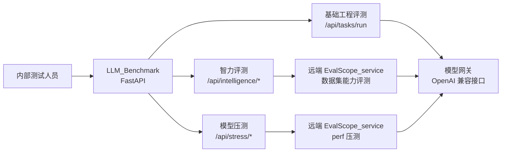

# EvalScope 压测集成设计

## 1. 背景与目标

本项目 `LLM_Benchmark` 当前负责模型网关上线前的基础工程评测，并已通过 `/api/intelligence/*` 接入远端 EvalScope 服务做智力评测。用户确认：模型压测执行应放在另一台服务器上的 `EvalScope_service` 侧，本项目只做模型配置读取、任务编排、状态查询、结果归档和 Markdown 报告生成。

本设计目标是为系统新增“模型压测”能力，用 EvalScope `perf` 替代或增强当前基础指标中的性能负载类测试，同时保留本项目对协议、错误结构、上下文、输出、usage、缓存字段和流式规范的基础检查。

## 2. 指标边界划分

### 2.1 可由 EvalScope 压测替代或作为正式来源

| 当前指标 | 处理方式 | 说明 |
|---|---|---|
| `concurrency` 并发承载 | 正式压测迁移到 EvalScope | 使用 `parallel`、`number` 多档位压测，统计成功率、失败数、吞吐和延迟分位。 |
| `rate_limit` 限流行为 | 由 EvalScope 压测增强 | 通过并发或速率压测观察 429、超时、5xx、失败率和吞吐拐点。 |
| `latency_breakdown` 延迟拆解 | 性能统计迁移到 EvalScope | 使用流式压测统计 TTFT、TPOT、ITL、Latency avg/p50/p95/p99。 |

### 2.2 可由 EvalScope 增强，但不完全替代

| 当前指标 | 处理方式 | 说明 |
|---|---|---|
| `cache_behavior` 缓存能力 | 保留本项目 smoke，增加 EvalScope 长前缀压测 | 本项目继续检查 usage 中 cached_tokens/cache_hit 字段；EvalScope 负责长前缀、高并发缓存收益曲线。 |
| `output_length` 输出长度 | 保留本项目能力检查 | EvalScope 可测不同输出长度下性能，但不替代最大输出可用性和 finish_reason 检查。 |
| `token_usage_accuracy` Token 用量观测 | 保留本项目字段检查 | EvalScope 使用 token 统计吞吐，本项目继续观察 usage 字段结构和本地估算差异。 |

### 2.3 必须继续保留在本项目

| 当前指标 | 保留原因 |
|---|---|
| `connectivity` | 模型网关基础连通性和 JSON/内容/finish_reason/usage smoke。 |
| `context_length` | 长上下文可用性和 marker 找回，不是纯性能压测。 |
| `error_handling` | 无效 key、无效模型、空输入、非法参数、上下文超限等错误结构验证。 |
| `stream_spec` | SSE chunk、`[DONE]`、finish_reason、stream usage 等协议规范验证。 |

## 3. 总体架构



系统形成三条评测线：

1. **基础工程评测**：同步、轻量、协议与能力 smoke，继续由 `LLM_Benchmark` 执行。
2. **智力评测**：现有 `/api/intelligence/*`，远端 EvalScope 执行数据集评测。
3. **模型压测**：新增 `/api/stress/*`，远端 EvalScope_service 执行 `evalscope perf`，本项目统一落库和报告。

## 4. LLM_Benchmark 改造设计

### 4.1 新增模块

```text
app/stress/
  __init__.py
  schemas.py
  evalscope_stress_client.py
  runner.py
  report.py
app/api/routes_stress.py
app/storage/stress_task_store.py
```

职责划分：

- `schemas.py`：定义压测请求、任务状态、标准化结果、报告元数据。
- `evalscope_stress_client.py`：调用远端 EvalScope_service `/api/v1/stress/*`。
- `runner.py`：读取本地模型配置，映射协议，提交远端任务，刷新状态，拉取结果。
- `report.py`：生成中文 Markdown 压测报告。
- `stress_task_store.py`：将本地压测任务保存到 JSON 文件。
- `routes_stress.py`：暴露本项目 `/api/stress/*` 接口。

### 4.2 本地存储

```text
data/stress_tasks/stress_task_*.json
reports/stress/YYYY-MM-DD/stress_task_*.md
```

运行时配置复用或扩展现有 `data/evalscope.json`，建议增加：

```json
{
  "base_url": "http://<evalscope-host>:8010/api/v1",
  "default_timeout_seconds": 14400,
  "stress_timeout_seconds": 86400
}
```

`data/evalscope.json` 属于运行时配置，不提交 Git。

### 4.3 本项目新增接口

```http
GET  /api/stress/evalscope/health
POST /api/stress/tasks/default
POST /api/stress/tasks
GET  /api/stress/tasks
GET  /api/stress/tasks/{task_id}
GET  /api/stress/tasks/{task_id}/result
GET  /api/stress/reports/{task_id}
```

### 4.4 默认压测请求

```json
{
  "model_id": "TC-minimax-m3",
  "parallel": [1, 5, 10, 20],
  "number": [10, 50, 100, 200],
  "dataset": "random",
  "stream": true,
  "min_prompt_length": 1024,
  "max_prompt_length": 1024,
  "min_tokens": 512,
  "max_tokens": 512,
  "rate": -1,
  "tokenizer_path": "Qwen/Qwen2.5-7B-Instruct",
  "extra_args": {}
}
```

### 4.5 模型配置映射

| 本项目模型配置 | 远端 EvalScope 压测字段 |
|---|---|
| `model` / `model_name` | `model` |
| `base_url` | `url`，根据协议拼接 `/chat/completions` 或 `/responses` |
| `api_key` | `api_key`，只传输，不写报告 |
| `protocol=chat_completions` | `api=openai` |
| `protocol=responses` | `api=openai_responses` |

报告、任务 JSON 和日志中必须对 API Key 脱敏。

## 5. EvalScope_service 改造设计

当前 `EvalScope_service` 已有能力评测任务管理，但没有压测接口。建议新增独立压测模块，避免和现有 `EvalTask` 混合。

### 5.1 新增模块

```text
EvalScope_service/app/api/stress_routes.py
EvalScope_service/app/api/stress_schemas.py
EvalScope_service/app/engine/stress_task_manager.py
```

### 5.2 远端新增接口

```http
GET  /api/v1/stress/health
POST /api/v1/stress
POST /api/v1/stress/default
GET  /api/v1/stress/tasks
GET  /api/v1/stress/tasks/{task_id}
GET  /api/v1/stress/tasks/{task_id}/result
GET  /api/v1/stress/tasks/{task_id}/report
```

### 5.3 远端执行方式

优先使用 EvalScope Python API：

```python
from evalscope.perf.main import run_perf_benchmark
from evalscope.perf.arguments import Arguments
```

如果 Python API 返回结构不稳定，再降级为 subprocess 执行官方 CLI，并解析输出目录中的 `performance_summary.txt`、`benchmark.log` 或结构化结果文件。

核心参数：

- `api`: `openai` 或 `openai_responses`
- `url`: 模型请求 endpoint
- `model`: 被测模型名
- `api_key`: 被测模型 key
- `parallel`: 并发档位
- `number`: 每档请求总数
- `rate`: 请求速率，`-1` 表示尽快发送但受并发上限约束
- `stream`: 是否流式，测 TTFT 时必须开启
- `dataset`: 默认 `random`
- `tokenizer_path`: random 数据集 token 统计所需
- `min_prompt_length` / `max_prompt_length`: 输入长度控制
- `min_tokens` / `max_tokens`: 输出长度控制
- `prefix_length` / `dataset_args.prefix_file`: 缓存或长上下文压测扩展参数

## 6. 压测结果标准化

本项目从远端结果中标准化以下字段：

```json
{
  "task_id": "stress_task_xxx",
  "evalscope_stress_task_id": "stress-xxx",
  "model_id": "TC-minimax-m3",
  "status": "completed",
  "summary": {
    "max_success_parallel": 20,
    "best_req_throughput": 12.3,
    "best_output_throughput": 10240.5,
    "first_error_parallel": null
  },
  "runs": [
    {
      "parallel": 1,
      "number": 10,
      "total": 10,
      "success": 10,
      "failed": 0,
      "success_rate": 1.0,
      "request_throughput": 1.2,
      "output_throughput": 900.0,
      "avg_latency_seconds": 0.8,
      "p50_latency_seconds": 0.7,
      "p95_latency_seconds": 1.1,
      "p99_latency_seconds": 1.3,
      "avg_ttft_ms": 120.0,
      "p95_ttft_ms": 200.0,
      "avg_tpot_ms": 12.0,
      "p95_tpot_ms": 18.0
    }
  ],
  "errors": []
}
```

不设置自动上线阈值，不输出“通过/失败”，只输出观测事实和分析建议。

## 7. Markdown 报告结构

压测报告路径：

```text
reports/stress/YYYY-MM-DD/stress_task_*.md
```

报告章节：

1. **一眼看懂**：最大成功并发、吞吐峰值、延迟恶化拐点、失败/限流开始出现的档位。
2. **任务概览**：本地任务 ID、远端任务 ID、模型 ID、协议、EvalScope 地址、创建/更新时间。
3. **压测配置**：parallel、number、rate、stream、输入长度、输出长度、dataset、tokenizer。
4. **并发档位结果表**：成功率、失败数、RPS、Token 吞吐、Latency、TTFT、TPOT 分位。
5. **异常摘要**：429、timeout、5xx、解析失败、其他异常。
6. **原始结果附录**：脱敏后的 EvalScope 原始 JSON 或摘要文本。

## 8. 与现有基础评测的关系

`gateway_baseline_v1` 第一阶段不删除现有指标。后续可在报告中增加提示：

- `concurrency`、`rate_limit`、`latency_breakdown` 的基础评测结果为“轻量 smoke”。
- 正式性能压测请查看 `/api/stress/*` 生成的 EvalScope 压测报告。

这样既不破坏当前上线前基础评测链路，也能逐步把性能结论迁移到更专业的 EvalScope 压测。

## 9. 安全与配置要求

- 不在 Git 中提交 `data/models.json`、`data/evalscope.json`、`data/stress_tasks/`、`reports/`、`.env`、`.venv/`。
- API Key 只用于请求远端服务，不写入 Markdown 报告、任务 JSON 或错误日志。
- 远端 EvalScope_service 运行在内网，不做平台鉴权；如后续跨网段访问，再补充服务间鉴权。
- 压测可能对模型网关产生明显负载，默认压测档位必须保守，允许用户自定义更高档位。

## 10. 验收标准

1. 本项目可通过 `POST /api/stress/tasks/default` 根据 `model_id` 提交远端压测任务。
2. 本项目可查询本地压测任务、刷新远端状态、获取远端结果。
3. 远端 EvalScope_service 可异步执行 `evalscope perf`，并暴露状态、结果和报告接口。
4. 压测结果被标准化为 JSON，同时生成中文 Markdown 报告。
5. 报告中不泄露 API Key。
6. 现有 `/api/tasks/run` 和 `/api/intelligence/*` 行为不被破坏。
7. 项目测试通过，至少覆盖请求映射、任务存储、结果标准化、报告脱敏和错误路径。
