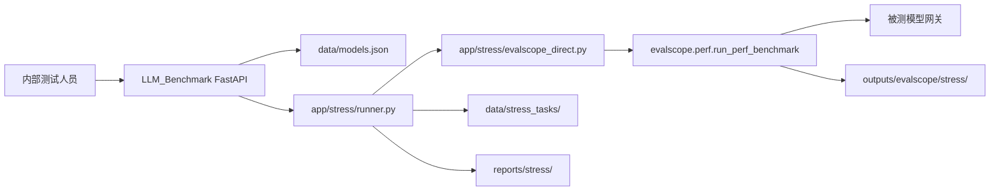

# EvalScope 压测集成设计（in-process 版）

> 日期：2026-08-06
> 状态：已按用户反馈收缩为主服务内直接调用 EvalScope Python package。

## 1. 背景与目标

`LLM_Benchmark` 负责模型网关上线前的基础工程评测。压测能力使用 EvalScope `perf` 作为正式性能/负载数据来源，但不再额外包装 HTTP 执行服务；主服务直接调用 `evalscope.perf.main.run_perf_benchmark(Arguments)`。

目标：

- 保留 `/api/stress/*` 作为本项目统一入口。
- 复用 `data/models.json` 中的模型协议、地址、模型名和密钥。
- 将请求映射为 EvalScope perf 参数，执行后归档本地 JSON 和 Markdown 报告。
- 保留 EvalScope 原始输出在 `outputs/evalscope/stress/`，便于使用 EvalScope 自带分析/可视化能力。
- 与网关 smoke、能力评测、overview 和 suite 编排共存。

## 2. 指标边界

- `/api/tasks/run`：保留连通性、协议、错误结构、上下文、输出长度、usage、缓存字段和流式规范 smoke。
- `/api/stress/*`：作为并发、吞吐、延迟分位、TTFT/TPOT、限流/容量边界的正式来源。
- `/api/overview/*`：只做摘要和导航，不替代 EvalScope 原生可视化。

## 3. 当前架构

## 4. 模块职责

- `app/stress/schemas.py`：压测请求、任务、标准化结果模型。
- `app/stress/evalscope_direct.py`：构造 `Arguments` 并直接调用 EvalScope perf。
- `app/stress/runner.py`：模型读取、参数映射、后台执行、结果标准化、报告写入。
- `app/stress/report.py`：中文 Markdown 报告。
- `app/api/routes_stress.py`：公开 `/api/stress/*`。
- `app/storage/stress_task_store.py`：本地 JSON 归档。

## 5. 安全要求

- `api_key` 只能在运行时传给 EvalScope，不保存到任务 JSON、报告或日志。
- `data/models.json`、`data/evalscope.json`、`outputs/`、`reports/` 都不提交。
- 如果未来拆出远程 worker，需要重新设计服务间鉴权、超时和任务状态同步。
